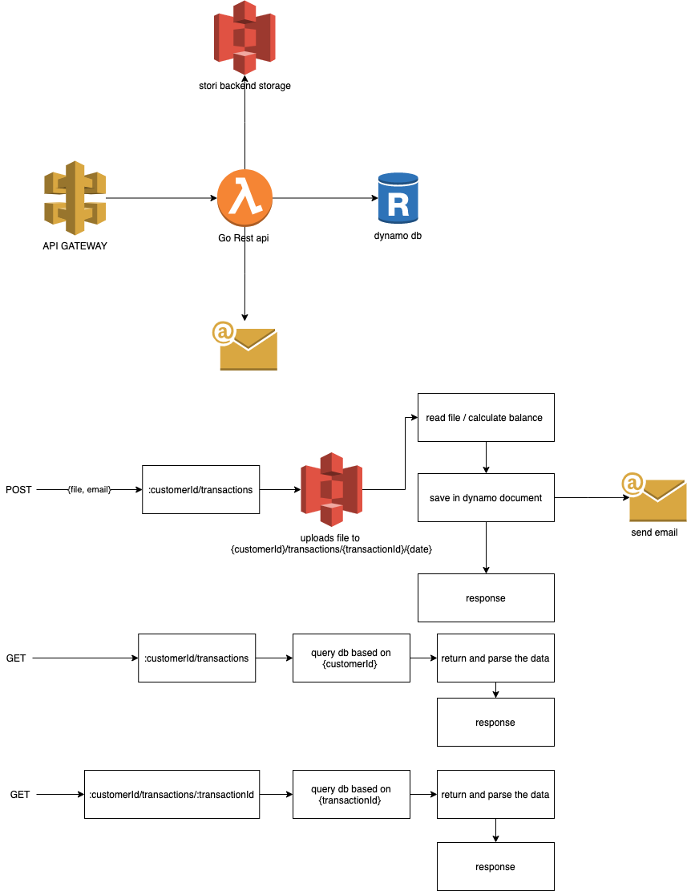

# Stori transaction procesor



## use postman collection

- postman collection is set up with production url
- select files from examples directory
- add your own email to receive messages

[stori-back.postman_collection](stori-back.postman_collection.json)

## API endpoints

production url: `https://lferw0dh07.execute-api.us-east-1.amazonaws.com/prod`

customerId: `Any integer number`

transactionId: `Any transaction uuid generated through api`

files: `Any file from examples directory or from your own `
endpoints:

```
POST /api/{customerId}/transactions (process file)

GET /api/{customerId}/transactions (list customer transactions)

GET /api/{customerId}/transactions/{transactionId} ( get single customer transaction)
```

## Local Installation

### dependencies

- go 1.18 or major
- cdk https://aws.amazon.com/en/cdk/
- AWS testing credentials

## modules installation

First go to cdk directory and install go dependencies

```sh
cd cdk
go mod download
```

Second go to function directory and install go dependencies

```sh
cd ../function
go mod download
```

once you have downloaded all dependencies you can run the following command over function directory
this will export requried environment variables to the current shell session.

```sh
source export-env.sh
```

in order to validate the project can run you should be able to run:

```sh
go run .
```

expect to see a result like this:

```sh
[GIN-debug] [WARNING] Creating an Engine instance with the Logger and Recovery middleware already attached.

[GIN-debug] [WARNING] Running in "debug" mode. Switch to "release" mode in production.
 - using env:	export GIN_MODE=release
 - using code:	gin.SetMode(gin.ReleaseMode)

[GIN-debug] POST   /api/:customerId/transactions --> main.ProcessTxnFile (3 handlers)
[GIN-debug] GET    /api/:customerId/transactions --> main.GetCustomerTransactions (3 handlers)
[GIN-debug] GET    /api/:customerId/transactions/:transactionId --> main.GetTransaction (3 handlers)
[GIN-debug] Listening and serving HTTP on :8080
```

## Infraestructure setup

in case you want to deploy the infraestructure in your AWS account you can run the following command

⚠️ USE PERSONAL AWS CREDENTIALS, DO NOT RUN USING COMPANY AWS CREDENTIALS ⚠️

```sh
cdk boostrap
cdk synth
cdk deploy
```
